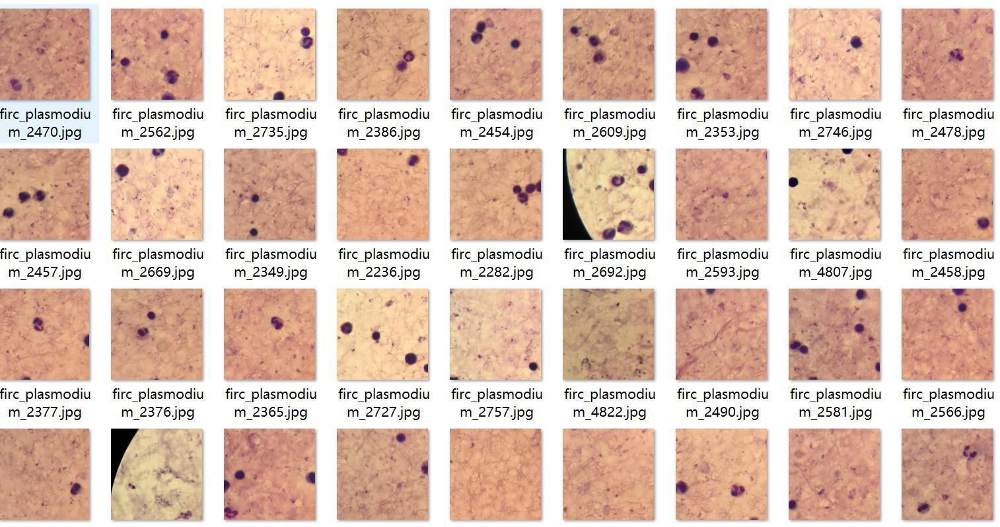
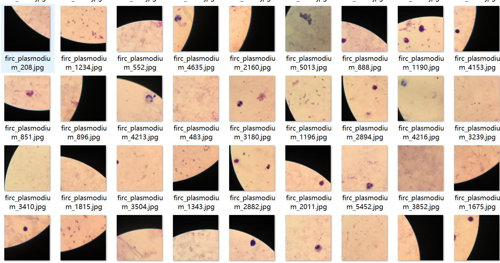
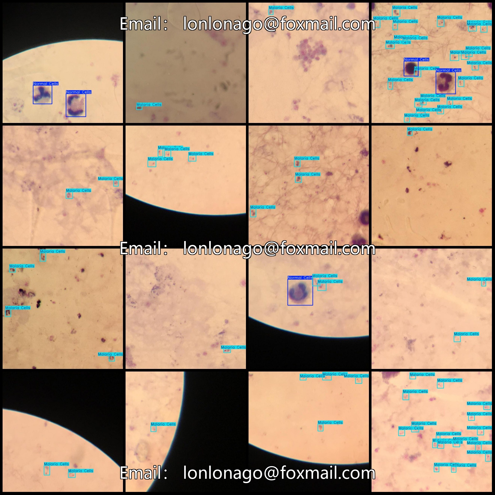
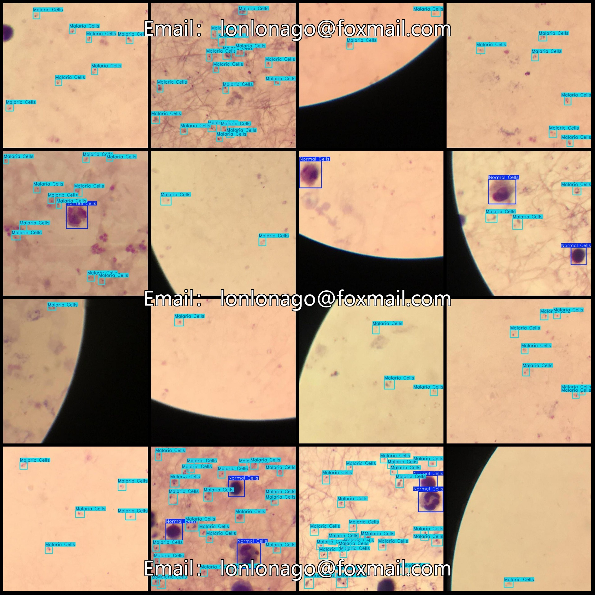

# Malaria Cell Detection Dataset in VOC+YOLO Format with 5452 Images in 2 Categories

Dataset format: Pascal VOC format + YOLO format (txt file without split path, only contains jpg images and corresponding VOC format xml files and yolo format txt files)

Number of images (jpg file count): 5452
Number of annotations (xml file count): 5452
Number of annotations (txt file count): 5452
Number of annotation categories: 2
Annotation category count (note that the order of labels in yolo format is not consistent with this, but based on the classes.txt file in the labels folder): ["Malaria Cells", "Normal Cells"]
Each category of annotations:
- Malaria Cells (malaria cells) boxes = 21797
- Normal Cells (normal cells) boxes = 2457
Total boxes: 24254
Each category of images occupied:
- Malaria Cells (malaria cells) occupied images = 4773
- Normal Cells (normal cells) occupied images = 1875
Image resolution: 640x640
Using labeling tool: labelImg
Labeling rules: draw boxes around the categories
Important note: The dataset does not have been divided into training validation test sets, so it needs to be divided by oneself.
Special declaration: This dataset does not guarantee the accuracy of the models or weight files trained.
Image preview:
Annotation example:
## Images

Here is a pay link on Stripe ( https://buy.stripe.com/3cs8yP7sY87d0vu9AB ). Please contact me lonlonago@foxmail.com after funding $89, and I will send you a complete data files , thank you!

